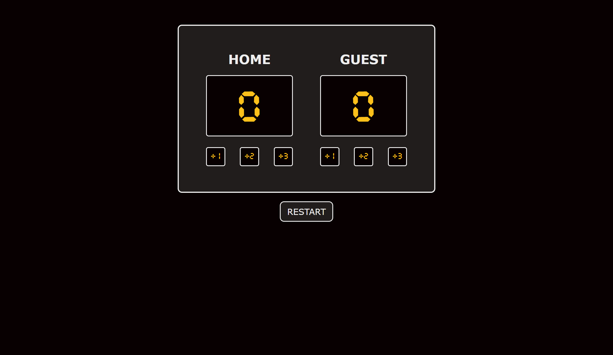

# Basketball Scoreboard (Project)

Solo project from Scrimba's Front-End Developer Path (Module 3). 

## About

A simple version of a basketball scoreboard to understand basic JavaScript concepts (variables, functions, math operations, etc). 

## Built with

- HTML5
- CSS
- JavaScript

## Live URL

- [Basketball Scoreboard](https://jonathancazares.github.io/front-end-projects/Scrimba/basketball_scoreboard/)

## Screenshots

## Things I want to improve/add

- Make it responsive
- Implement conditional statements to find a winner (when their points are equal to or greater than 21)
- Undestand how to create a timer
