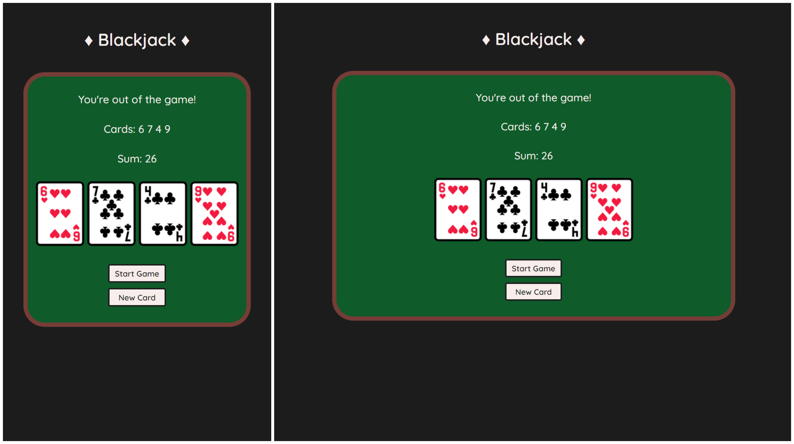

# Blackjack (Project)

Solo project from Scrimba's Front-End Developer Path (Module 3).

## About

A simple version of a BlackJack game to understand the use of:
- arrays
- objects
- boleans
- if/else if/else statements
- logical and comparison operators
- for loops
- functions with return values

I improved the original design by implementing a function that appends corresponding images for each card value stored in the cards[] array. This enhances the overall experience. 

## Built with

- HTML5
- CSS
- JavaScript

## Live URL

- [Blackjack](https://jonathancazares.github.io/front-end-projects/Scrimba/blackjack/)

## Screenshots

## Things I want to improve/add

- Right now, the game has only two outcomes: either the player gets BlackJack or loses the game when the sum exceeds 21. It's not possible to win. I want to add a botton/function that gives the user the opportunity to decide whether or not they want to draw more cards.
- I also want to create an opponent that the user can play against.
