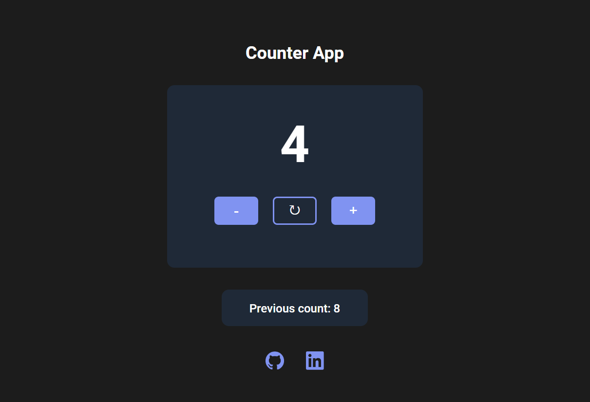
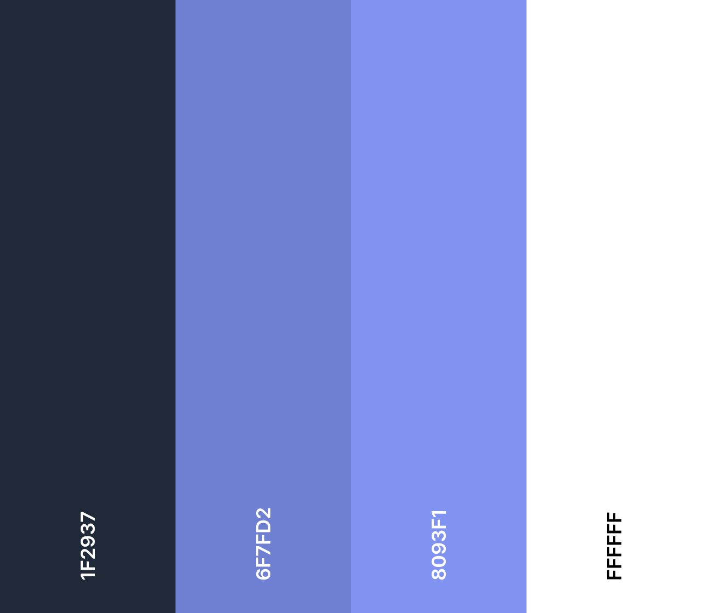
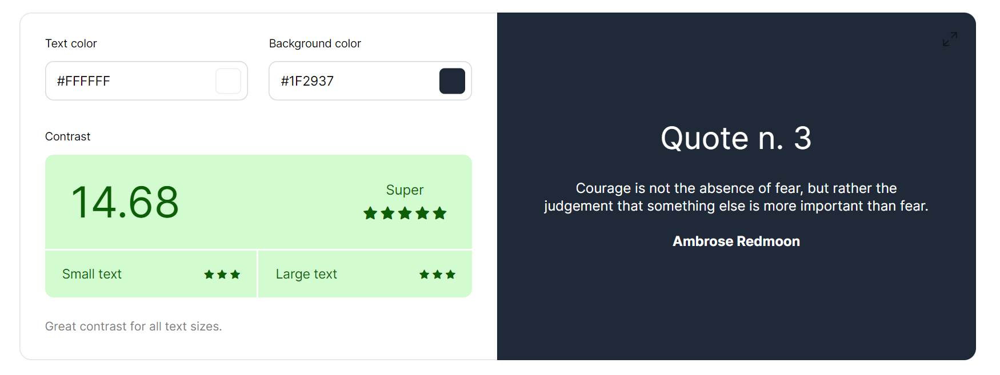

# Counter App (Project)

Project from Scrimba's Front-End Developer Path (Module 3). 

## About

A project focused on undestand basic JavaScript concepts and syntax. A project focused on understanding basic JavaScript concepts and syntax. I created three functions: **increment(), decrement(), and restart()** to modify the count variable (numeric value). 

## Built with

- HTML5
- CSS
- JavaScript

## Live URL

- [Counter App](https://jonathancazares.github.io/front-end-projects/Scrimba/counter_app/)

## Screenshots

## Color Palette

## Contrast Check 

