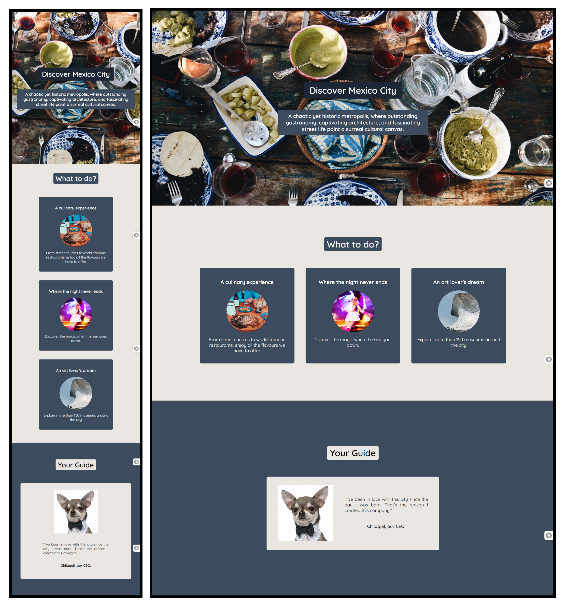

# Hometowm Homepage (Project)

First solo project from Scrimba's Front-End Developer Path (Module 2). 

## About

A project designed to promote Mexico City. I used Flexbox to create a responsive design and pseudo-classes to make it interactive. 

## Built with

- HTML5
- CSS

## Screenshots

## Color Palette

