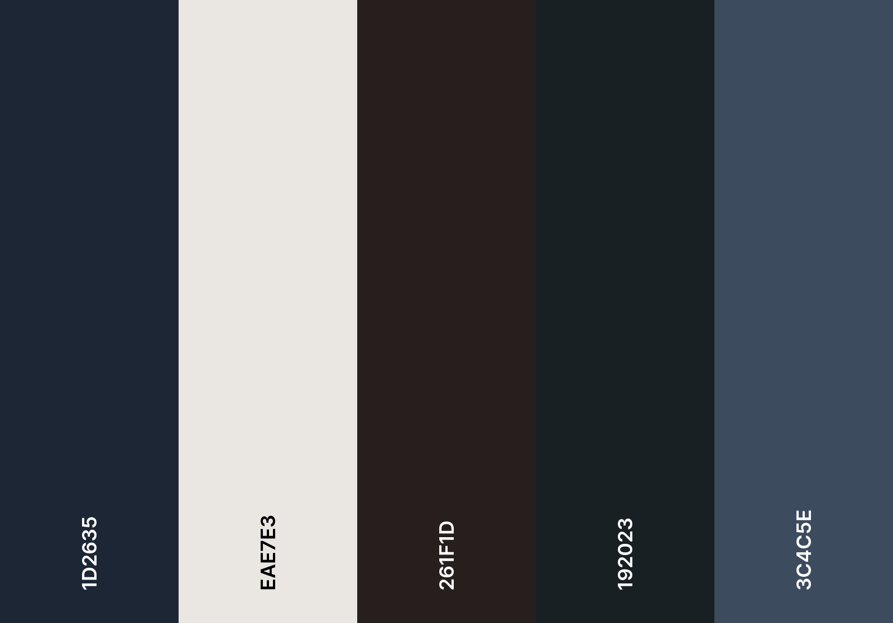
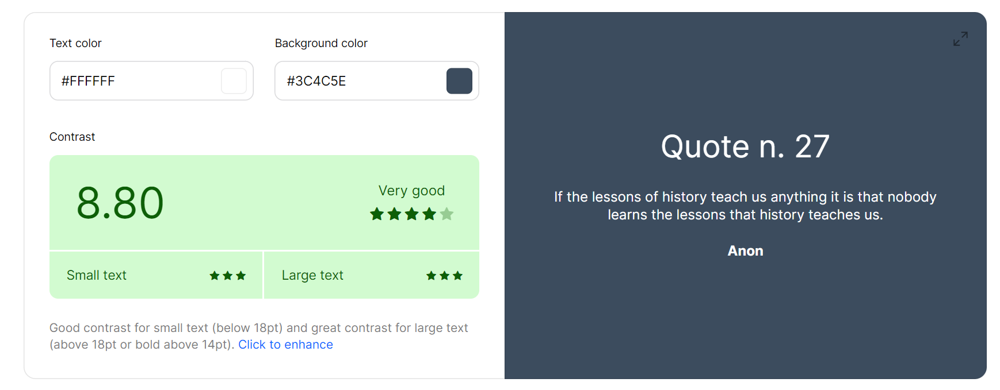

# Hometowm Homepage (Project)

First solo project from Scrimba's Front-End Developer Path (Module 2). 

## About

A project designed to promote Mexico City. I used Flexbox to create a responsive design and pseudo-classes to make it interactive. 

## Built with

- HTML5
- CSS

## Live URL

- [Hometown Homepage](https://jonathancazares.github.io/front-end-projects/Scrimba/hometown_homepage/)

## Screenshots

## Color Palette

## Contrast Check 

## Credits

- [Anna Petrow Photography](https://www.annapetrow.com/mexico-city)

